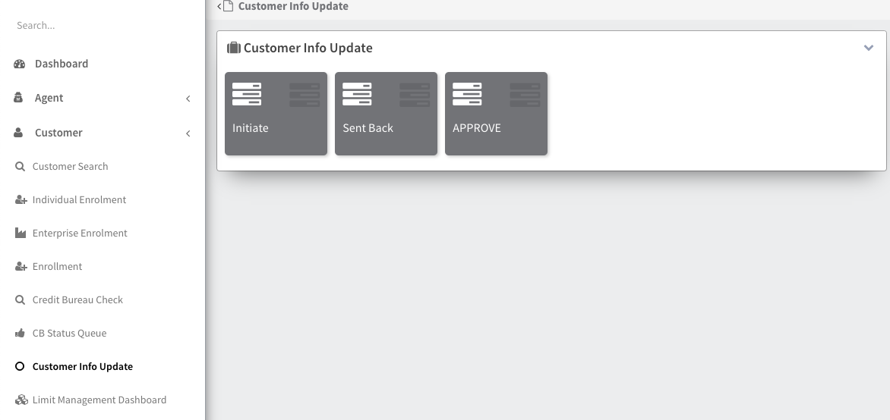
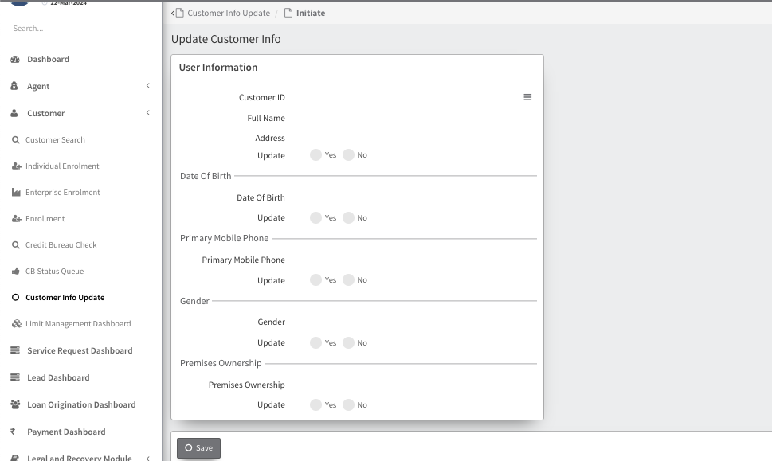
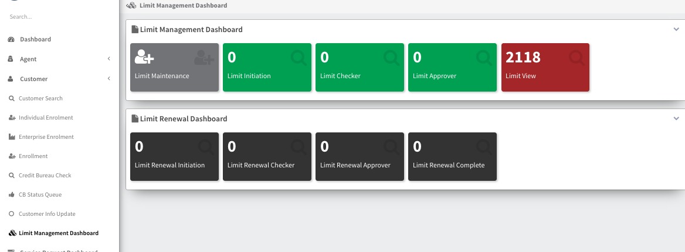

##     Customer Module

    The Customer Module provides functionalities for managing customer information and interactions. It includes the following key features:

### Customer Search Module

***The Customer Search Module provides a powerful search interface to locate customer records based on various criteria.***
***It includes the following search fields:***

- **Customer Name**: Search by the customer's full or partial name.
- **Last Name**: Search by the customer's last name.
- **Customer ID**: Search by the unique customer ID assigned in the system.
- **KYC No**: Search by the KYC (Know Your Customer) number associated with the customer.
- **URN No**: Search by the URN (Unique Reference Number) assigned to the customer.
- **Branch Name**: Search by the name of the branch associated with the customer.
- **Head Office**: Search for customers associated with the head office.
- **Spoke**: Search for customers associated with a specific spoke location.
- **Choose Spoke**: Select a specific spoke location to filter search results.
- **INCLUDE_DUPLICATES**: Include duplicate customer records in the search results.

The Customer Search Module provides a flexible and efficient way to find customer records, helping users quickly access the information they need for customer management and service delivery.

### Individual Enrollment
Individual Enrollment enables users to enroll individual customers into the system. This process collects and stores customer information such as personal details, contact information, and identification documents.

### Enterprise Enrollment
Enterprise Enrollment facilitates the enrollment of business entities or enterprises as customers. It captures information such as business details, contact information, and registration documents.

### Credit Bureau Check
Credit Bureau Check allows users to perform credit checks on customers using data from credit bureaus. This helps in assessing the creditworthiness of customers before offering financial products or services.

The Credit Bureau Check feature allows users to perform credit checks on customers using data from credit bureaus. It includes the following fields:

- **Customer Name**: The name of the customer (e.g., BHUBARAM).
- **Partner**: The partner organization (e.g., Kinara Capital).
- **Product**: The loan product (e.g., Working Capital - Secured).
- **Credit Bureau**: The credit bureau used for the check (e.g., HIGHMARK - BASE).
- **Loan Amount**: The amount of the loan (e.g., ₹1,000,000).
- **Loan Purpose**: The purpose of the loan (e.g., Business Development).
- **Force**: An optional field for forcing the credit bureau check.

The Credit Bureau Check feature streamlines the process of performing credit checks on customers, helping users assess the creditworthiness of customers before offering financial products or services.

### CB Status Queue
CB Status Queue manages the status of credit bureau checks for customers. It provides an overview of pending and completed checks, helping users track the progress of credit assessments.

### Customer Info Update

Customer Info Update allows users to update customer information such as contact details, addresses, or identification documents. It ensures that customer records are kept up-to-date and accurate.

The Customer Info Update module allows users to update customer details. It includes the following features:

### Update Customer Info
This feature enables users to update customer information. Users can choose a customer ID to update the details.
#### Update Confirmation

Users can update the following details by confirming the update confirmation:

- **Address**: Update the customer's address.
  - **Update**: Click to update the address.
  - **YesNo**: Select Yes or No to confirm the update.

- **Date Of Birth**: Update the customer's date of birth.
  - **Update**: Click to update the date of birth.
  - **YesNo**: Select Yes or No to confirm the update.

- **Primary Mobile Phone**: Update the customer's primary mobile phone number.
  - **Update**: Click to update the primary mobile phone number.
  - **YesNo**: Select Yes or No to confirm the update.

- **Gender**: Update the customer's gender.
  - **Update**: Click to update the gender.
  - **YesNo**: Select Yes or No to confirm the update.

- **Premises Ownership**: Update the customer's premises ownership status.
  - **Update**: Click to update the premises ownership status.
  - **YesNo**: Select Yes or No to confirm the update.

### Update Stages

After updating the customer information, the record will go through the following stages:

- **Initiate**: The update request is initiated.
- **Sent Back**: The update request is sent back for further review or information.
- **APPROVE**: The update request is approved.

The Customer Info Update module provides a streamlined process for updating customer details, ensuring that customer records are accurate and up-to-date.

### Limit Management Dashboard
Limit Management Dashboard provides a centralized view of customer credit limits and other limits set by the organization. It allows users to monitor and manage customer limits efficiently.

The Customer Module streamlines customer management processes, enabling organizations to maintain accurate customer records and provide better customer service.
