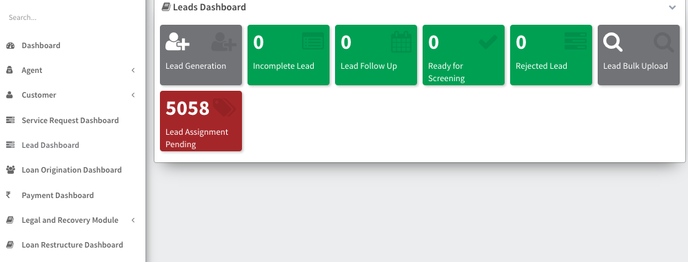
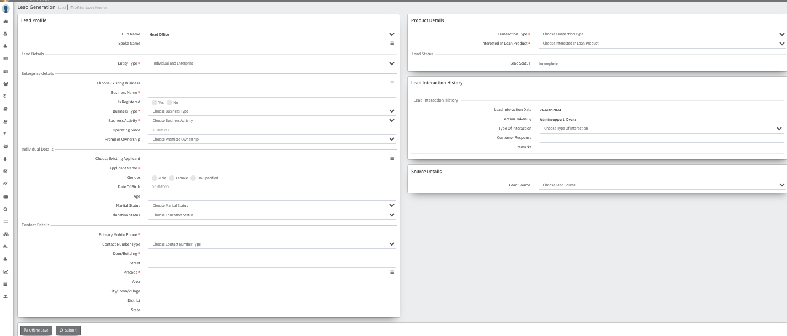

## Lead Generation Module

    The Lead Generation module facilitates the process of generating and managing leads. It includes the following key stages:

### Leads Dashboard

The Leads Dashboard provides an overview of all leads in the system. It includes the following stages:

- **Lead Generation**: Leads that have been generated but not yet processed.
- **Incomplete Lead**: Leads that are missing required information or are not yet ready for follow-up.
- **Lead Follow Up**: Leads that are being actively followed up on by sales or marketing teams.
- **Ready for Screening**: Leads that have been processed and are ready for further screening or evaluation.
- **Rejected Lead**: Leads that have been rejected due to various reasons.

### Lead Bulk Upload

The Lead Bulk Upload feature allows users to upload leads in bulk, streamlining the process of adding multiple leads to the system at once.

- **Total Leads Uploaded**: Indicates the total number of leads that have been uploaded using this feature.

### Lead Assignment Pending

Leads that are pending assignment to a specific sales or marketing representative. These leads are awaiting assignment based on criteria such as location, product interest, or other factors.

The Lead Generation module helps organizations efficiently manage leads from generation to assignment, ensuring that leads are properly followed up on and converted into opportunities.

# Lead Generation 

## Lead Profile

- **Hub Name:** [Hub Name]
- **Head Office:** [Head Office]
- **Spoke Name:** [Spoke Name]

## Lead Details

- **Entity Type:** [Choose Entity Type: Individual / Enterprise]

### Enterprise Details

- **Choose Existing Business:** [Business Name if Existing / Leave Blank]
- **Business Name:** [Business Name]
- **Is Registered:** [Yes / No]
- **Business Type:** [Choose Business Type]
- **Business Activity:** [Choose Business Activity]
- **Operating Since:** [DDMMYYYY]
- **Premises Ownership:** [Choose Premises Ownership]

### Individual Details

- **Choose Existing Applicant:** [Applicant Name if Existing / Leave Blank]
- **Applicant Name:** [Applicant Name]
- **Gender:** [Choose Gender: Male / Female / Un-Specified]
- **Date of Birth:** [DDMMYYYY]
- **Age:** [Age]
- **Marital Status:** [Choose Marital Status]
- **Education Status:** [Choose Education Status]

## Contact Details

- **Primary Mobile Phone:** [Primary Mobile Phone]
- **Contact Number Type:** [Choose Contact Number Type]
- **Door/Building:** [Door/Building]
- **Street:** [Street]
- **Pincode:** [Pincode]
- **Area:** [Area]
- **City/Town/Village:** [City/Town/Village]
- **District:** [District]
- **State:** [State]

# Product Details

## Transaction Type
- **Transaction Type:** [Choose Transaction Type]

## Loan Product Interest
- **Interested In Loan Product:** [Choose Interested In Loan Product]

## Lead Status
- **Lead Status:** [Lead Status]

# Lead Interaction History

- **Lead Interaction Date:** 10-Dec-2023
- **Action Taken By:** Adminsupport_Dvara
- **Type Of Interaction:** [Choose Type Of Interaction]
- **Customer Response:** [Customer Response]
- **Remarks:** [Remarks]

# Source Details
- **Lead Source:** [Choose Lead Source]

# Lead Interaction History
- **Lead Interaction Date:** []
- **Action Taken By:** []
- **Type Of Interaction:** [Choose Type Of Interaction]
- **Customer Response:** [Customer Response]
- **Remarks:** [Remarks]
