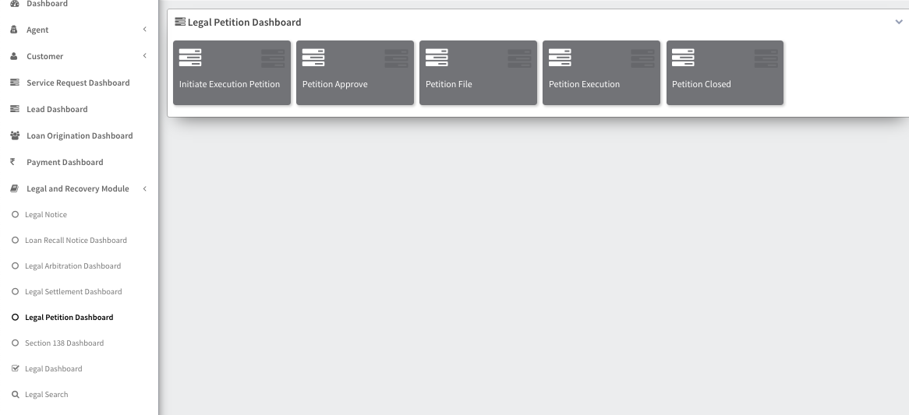

## Legal and Recovery Module

    The Legal and Recovery Module is designed to manage legal proceedings and recovery activities related to loans. It includes the following key functionalities:

### Legal Notice

The Legal Notice feature allows users to generate and manage legal notices sent to borrowers for various purposes such as loan default or legal actions.

### Loan Recall Notice Dashboard

The Loan Recall Notice Dashboard provides an overview of all loan recall notices issued to borrowers. It allows users to track the status of recall notices and manage related actions.

### Legal Arbitration Dashboard

The Legal Arbitration Dashboard provides a centralized view of all arbitration cases related to loan recovery. It enables users to monitor the progress of arbitration proceedings and take necessary actions.

### Legal Settlement Dashboard

The Legal Settlement Dashboard displays information about settlements reached in legal cases related to loan recovery. It helps users track the status of settlements and manage related documentation.

### Legal Petition Dashboard

The Legal Petition Dashboard provides a summary of all legal petitions filed in court for loan recovery purposes. It enables users to monitor the status of petitions and manage court appearances.

### Section 138 Dashboard

The Section 138 Dashboard focuses on cases related to dishonored cheques under Section 138 of the Negotiable Instruments Act. It provides details about such cases and helps manage legal actions.

### Legal Dashboard

The Legal Dashboard serves as a comprehensive overview of all legal activities and proceedings related to loan recovery. It provides a centralized view of legal cases, notices, settlements, and petitions.

### Legal Search

The Legal Search feature allows users to search for specific legal cases, notices, or other legal documents based on various criteria. It helps users quickly locate relevant information within the legal system.

The Legal and Recovery Module provides robust tools for managing legal processes and recovery activities, ensuring compliance with legal requirements and efficient recovery of loans.
