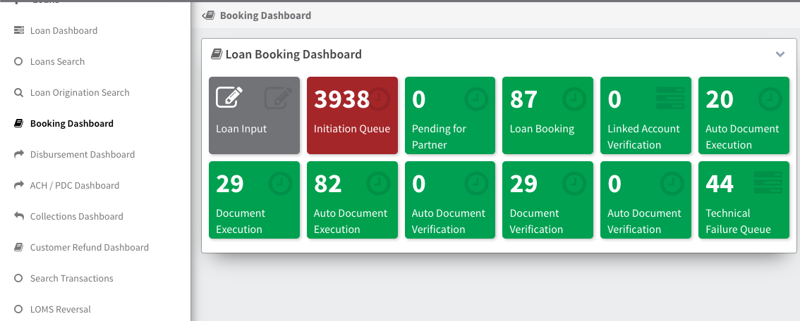

## Loan Booking Module

    The Loan Booking module handles the process of booking loans within the system. It includes the following stages:

### Loan Booking Dashboard

The Loan Booking Dashboard provides an overview of the loan booking process. It includes the following stages:

- **Loan Input**: Loans that have been input into the system and are awaiting further processing.
[Loan Input](LoanInput.md)
- **Initiation Queue**: Loans that are in the queue for initiation.
- **Pending for Partner**: Loans that are pending approval or processing by a partner or external entity.
- **Loan Booking**: Loans that have been booked successfully.
- **Linked Account Verification**: Loans that require verification of linked accounts.
- **Auto Document Execution Queue**: Loans in the queue for automatic document execution.
- **Document Execution**: Loans undergoing document execution.
- **Auto Document Execution Failed Queue**: Loans that failed automatic document execution.
- **Auto Document Verification Queue**: Loans in the queue for automatic document verification.
- **Document Verification**: Loans undergoing document verification.
- **Auto Document Verification Failed Queue**: Loans that failed automatic document verification.
- **Technical Failure Queue**: Loans that failed due to technical issues.

The Loan Booking module ensures that loans are processed efficiently and accurately, from input to verification and booking.
