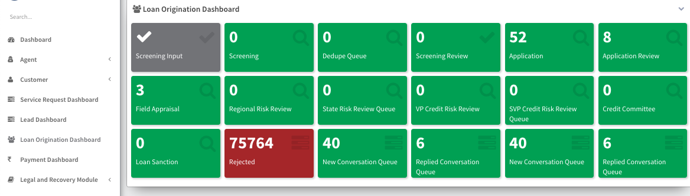

# Loan Origination Dashboard

    This is an overview screen showing the current status of all applications in the system that are in the process of loan origination before booking

1. **Screening Input:** This stage likely involves entering initial information about the loan application into the system.

2. **Screening:** This stage involves an initial screening process to determine basic eligibility criteria.

3. **Dedupe Queue:** This could be a queue for removing duplicate applications or records.

4. **Screening Review:** This stage likely involves reviewing the results of the initial screening process.

5. **Application:** This stage involves submitting the complete loan application.

6. **Application Review:** This stage involves reviewing the submitted loan application for completeness and accuracy.

7. **Field Appraisal:** This stage may involve a physical appraisal of the property or asset for which the loan is being requested.

8. **Regional Risk Review:** This stage may involve a review of the application by a regional risk assessment team.

9. **State Risk Review Queue:** This stage may involve a review of the application by a state-level risk assessment team.

10. **VP Credit Risk Review:** This stage may involve a review of the application by the Vice President of Credit Risk.

11. **SVP Credit Risk Review Queue:** This stage may involve a review of the application by the Senior Vice President of Credit Risk.

12. **Credit Committee:** This stage may involve a review of the application by a credit committee.

13. **Loan Sanction:** This stage involves the final decision on whether to approve or reject the loan application.

14. **Rejected:** Applications that have been rejected.

15. **New Conversation Queue:** This could be a queue for new communication threads related to the application.

16. **Replied Conversation Queue:** This could be a queue for communication threads that have been replied to.
