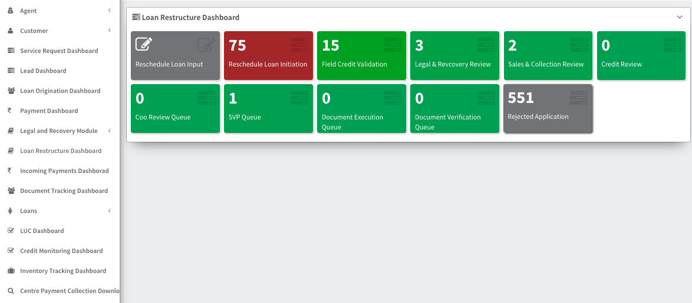
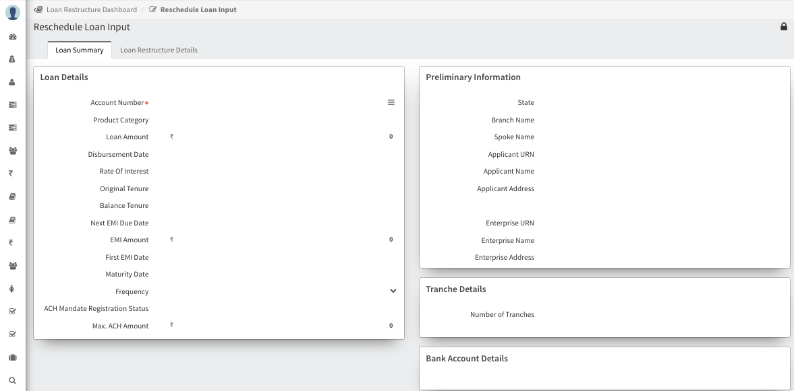
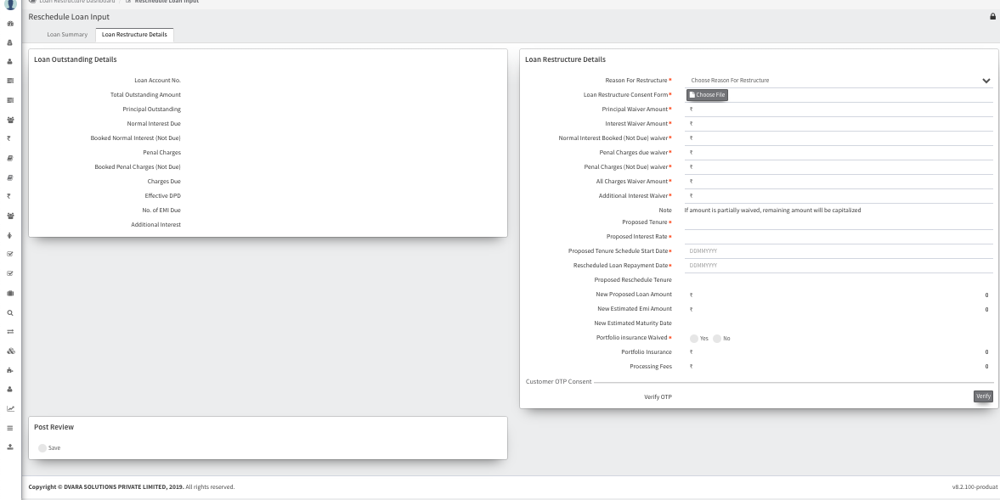

## Loan Restructure Module

    The Loan Restructure Module provides a structured approach to loan rescheduling, ensuring that the process is efficient, compliant, and aligned with organizational goals.

The Loan Restructure Module facilitates the restructuring of loans and includes various stages in the process:

### Loan Restructure Dashboard

The Loan Restructure Dashboard provides an overview of the current status of all loan restructuring activities. It allows users to monitor the progress of loan restructures and track any pending actions.

### Reschedule Loan Input
Reschedule Loan Input involves entering the necessary details for rescheduling a loan. This stage gathers information about the borrower, the existing loan terms, and the proposed changes.

### Reschedule Loan Initiation
Reschedule Loan Initiation is the process of initiating the loan rescheduling request. It involves submitting the rescheduling request for further processing and approval.
Loan Summary             |  Loan Restructure
:-------------------------:|:-------------------------:
  |  

### Field Credit Validation
Field Credit Validation involves validating the creditworthiness of the borrower for the rescheduled loan. This stage may include verifying income, employment status, and other relevant credit factors.

### Legal & Recovery Review
Legal & Recovery Review involves reviewing the rescheduling request from a legal and recovery perspective. This stage ensures that the rescheduling complies with legal requirements and does not adversely impact the recovery process.

### Sales & Collection Review
Sales & Collection Review involves reviewing the rescheduling request from a sales and collection perspective. This stage assesses the impact of the rescheduling on sales targets and collection efforts.

### Credit Review
Credit Review involves reviewing the rescheduling request from a credit risk perspective. This stage assesses the credit risk associated with the rescheduled loan and determines the appropriate terms and conditions.

### COO Review Queue
COO Review Queue is a queue for the Chief Operating Officer (COO) to review rescheduling requests that require their approval. This stage ensures that the rescheduling aligns with the organization's operational goals and objectives.

### SVP Queue
SVP Queue is a queue for the Senior Vice President (SVP) to review rescheduling requests that require their approval. This stage ensures that the rescheduling aligns with the organization's strategic objectives and risk management practices.

### Document Execution Queue
Document Execution Queue is a queue for executing the necessary documents for the rescheduled loan. This stage involves preparing and executing the new loan agreement and other relevant documents.

### Document Verification Queue
Document Verification Queue is a queue for verifying the documents related to the rescheduled loan. This stage ensures that all documentation is accurate and complete before finalizing the rescheduling.

### Rejected
Rejected indicates rescheduling requests that have been rejected. This could be due to various reasons such as incomplete documentation or failure to meet eligibility criteria.

