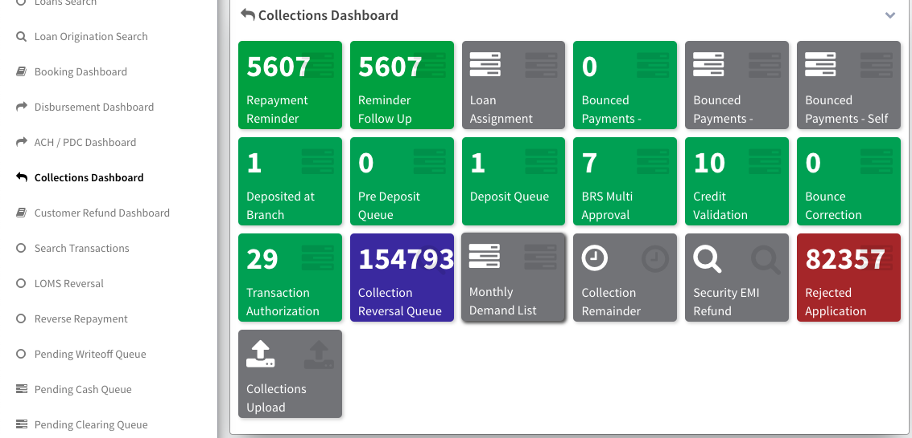

## Collections Dashboard

        The Collections Dashboard provides an overview of the loan collection process. It includes the following stages:

### Repayment Reminder

- **Repayment Reminder**: Reminders sent to borrowers for repayment.
- **Reminder Follow Up**: Follow-up actions taken on repayment reminders.

### Loan Assignment

- **Loan Assignment**: Loans assigned to specific collection agents or teams for follow-up.

### Bounced Payments

- **Bounced Payments - Spoke**: Payments bounced at spoke level.
- **Bounced Payments - Branch**: Payments bounced at branch level.
- **Bounced Payments - Self**: Payments bounced due to insufficient funds or other reasons.

### Deposit Management

- **Deposited at Branch**: Payments deposited at the branch.
- **Pre Deposit Queue**: Payments in the queue for pre-deposit processing.
- **Deposit Queue**: Payments in the queue for deposit processing.
- **BRS Multi Approval**: Multiple approvals required for Bank Reconciliation Statement (BRS).

### Validation and Authorization

- **Credit Validation Queue**: Loans in the queue for credit validation.
- **Bounce Correction Queue**: Queue for correcting bounced payments.
- **Transaction Authorization Queue**: Transactions in the queue awaiting authorization.

### Collection Reversal and Refunds

- **Collection Reversal Queue**: Queue for reversing collections.
- **Monthly Demand List**: List of monthly demand for loan repayments.
- **Collection Remainder**: Reminders sent to borrowers for outstanding collections.
- **Security EMI Refund**: Refunds processed for security EMI payments.

### Rejected Applications

- **Rejected Application**: Applications rejected during the collection process.

The Loan Collection Dashboard streamlines the collection process by providing insights and tools to effectively manage repayment reminders, bounced payments, deposit processing, and other collection-related activities.

- **Transaction Authorization Queue**: : Transactions in the queue awaiting authorization. The queue record will route you to the Transaction Authorization Page for completing the process of collection. The fields' descriptions are below:

This section provides details about payment transactions awaiting authorization, including enterprise information, transaction details, and a breakdown of payment components such as principal, interest, charges, and amount allocation.

### Payment

#### Enterprise Details

- **Enterprise Name:** [Enterprise Name]
- **Transaction Name:** [Transaction Name]
- **Repayment Date:** [Repayment Date]

#### Payment Details

- **Principal:** ₹ [Principal]
- **Interest:** ₹ [Interest]
- **Security Deposit Due:** ₹ [Security Deposit Due]
- **Penal Charges:** ₹ [Penal Charges]
- **Booked Penal Charges (Not Due):** ₹ [Booked Penal Charges (Not Due)]
- **Fees And Other Charges:** ₹ [Fees And Other Charges]
- **Amount Due:** ₹ [Amount Due]
- **Amount Collected:** ₹ [Amount Collected]
- **Waive Penal Charges:** [Waive Penal Charges]
- **Waive Fees & Charges:** [Waive Fees & Charges]

#### Amount Allocation

- **Security EMI Amount:** ₹ [Security EMI Amount]
- **Fee Amount:** ₹ [Fee Amount]
- **Demand Amount:** ₹ [Demand Amount]
- **Booked Penal Charges (Not Due):** ₹ [Booked Penal Charges (Not Due)]
- **Excess Amount:** ₹ [Excess Amount]
